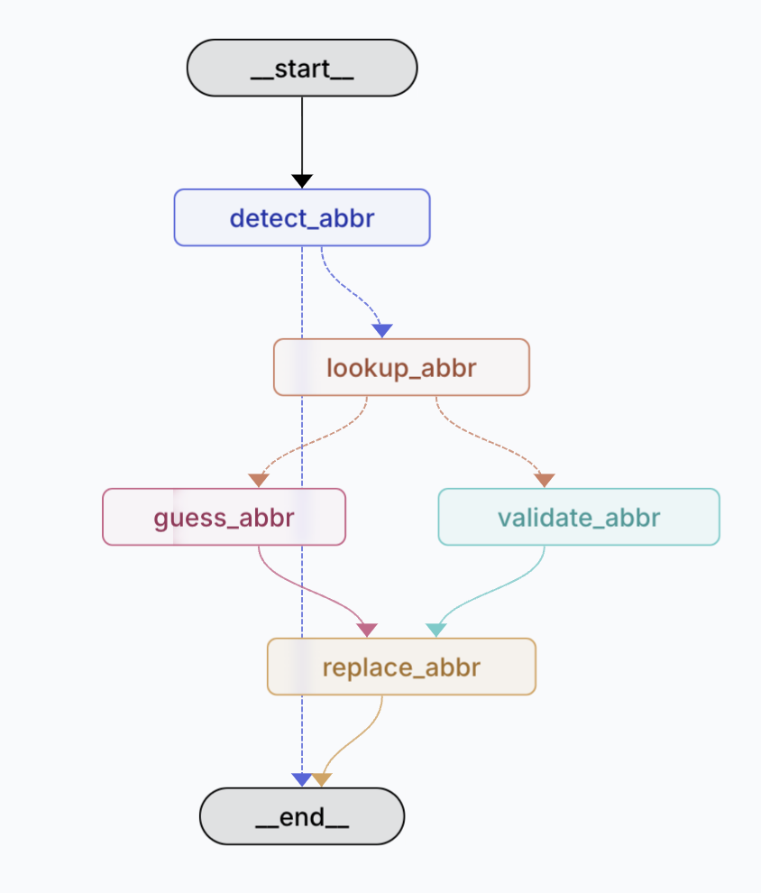

# Glossary Agent Pipeline


## Install

```bash
pip install -r requirements.txt
```


## Quick Start
### A. Inference from server
```bash
python run.py --cfg ./configs/kv-kv.yaml
```
### B. Inference from local ollama server
1. Setup ollama
```
brew install ollama
ollama pull [model_name]
ollama serve
```
2. Modify ```model_args``` in kv-kv.yaml
```
model_args:
  model: "[model_name]"
  api_key: "12345678"
  openai_api_base: "http://localhost:11434/v1"
  temperature: 0
```
3. Execute
```
python run.py --cfg ./configs/kv-kv.yaml
```

## Code Structure

```python
├── data
│   ├── kv_data
│   │   ├── glossary.jsonl
│   │   └── passage.txt
│   │
│   └── wiki_data
│       ├── glossary.jsonl
│       └── wiki00N.txt     # N wiki page text content
├── configs
│   └── kv-kv.yaml      # simple config temp
├── agents
│   ├── kv_agent        # template for pipeline
│   │   ├── agent.py    # graph & workflow
│   │   ├── nodes.py        
│   │   ├── prompts.py
│   │   └── states.py   # schemas
│   └── wiki_agent
│       └── ...    
├── .env
├── run.py       # inference code for kv pipeline
├── README.md
├── requirements.txt
├── langgraph.json
```